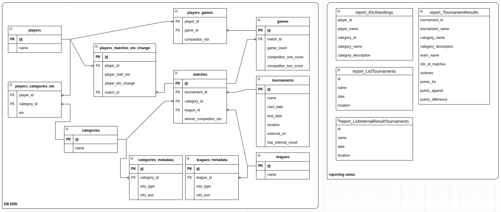

# Badminton Skill Calculator

This is personal project that is meant to collect tournament results information. Parse the players results and calculate ELO for each player for skill ranking. Currently developed for small tournaments where each player/team plays agains every other player/team one game. This code does not directly care about the tournament results, it just calculates ELO ranking after each match/round. It supports singles and doubles tournaments since these are two of the more common badminton tournament types(some regions of the world also have somewhat active 3v3 scene but not for me). This project does not specifically need to be used for Badminton, tehnically any kind of tournament with games and scores can use this project for ELO calculations. Only additinal challenges in this case is that data entry currently works only on specific formated tournaments so it's likely that you need to build your own custom tournament data parser.

I'm using some basic ELO calculations setup to learn more about how ELO raking works and how best to implement it for my situation. More details in the next chapter.

This started out as a personal development project. At this point it's been refined enought that it could be used as a standalone CLI application or even as a back-end tool that has some UI wrapper for it's usage. At some point the future I might also rewrite this project is some other language but will still keep it as CLI tool. Any additional usability changes should be separate wrapper projects on top of this tool.

## ELO Ranking Logic

This is just prototype calculation logic. Various elements can change in the future.

#### Basic functionality

- Each player has their own ELO score.
- Each new player starts at ELO score of 1000.
- ELO is calculated for one player against each opponents ELO and total change is summed together. *This logic needs more testing on IRL data to validate if it's good idea or not.*
- ELO change is scaled based on the difference of players current ELO.
- ELO calculations is done for each match.
- Placement in Tournament does not provide any additional points.

#### Formulas and calculation logic

- `k_factor` is main "constant" that is used to scale the final ELO change 
- `current_ELO` is the current players ELO value before new ELO calculation is done
- `expectation` variable calculation: `expectation = 1/(1+10**((current_ELO - current_ELO) / 400))`
- `result` variable is 1 or 0 based if player won or loss
- Final ELO change calue calculation: `ELO_change_value = k_factor * (result - expectation)`

#### `k_factor` scaling

- Standard base value: `32`
- `k_factor` scaling up means that ELO change is higher, used if significantly lower ranked player wins against high ranked player. Meaning lower ranked player will gain more points and higher ranked player will also lose more points.
- Scaling down makes ELO change lower, used when significantly higher ranked player wins against lower ranked player so the ELO change should not be significant.

#### scaling up

- ELO difference > 200: `k_factor` = 70
- ELO difference between 200 and 100: `k_factor` = 52
- ELO difference between 100 and 20: `k_factor` = 40
- ELO difference between 20 and 0: `k_factor` = 32

#### scaling down

- ELO difference > 200: `k_factor` = 2
- ELO difference between 200 and 100: `k_factor` = 12
- ELO difference between 100 and 20: `k_factor` = 24
- ELO difference between 20 and 0: `k_factor` = 32

## Completed functionality

- reads in excel file in specific tournament format that it's developed for.
- creates team objects and does not create duplicates if the team members order changes from tournament to tournament.
- does ELO calculation game by game basis from first game of first tournament to last game of last tournament in scanned scope for each individiual player.
- saves all data to SQLite database.
- has few status reports for output from database.
- handles any number of players in team, regular 1v1 and 2v2 but tehnically works with 3v3 or 11v11 if other type of competition is used.
- static site table generation for full raking on all categories

## Future Development

None of the points are in any specific priority order. I will work on any given topic that I'm interested in or if there is dependecy on it. 

List is not just code improvements but also project functionalities

### Near Future

- Various minor improvements in codes marked with TODO.
- GetOrAddPlayer function in Database package is a mess and needs some work.
- Extract details from Tournament name and store them in DB.
- Improve functionality to define category of the tournament.
- Add ELO confidence value and use it to handle ELO gain/loss.
- Tournament results statistics report users games count. Further change in the future since this has to change when matches consist of multiple games.
- Rework how commands/launch arguments are built and handled.

### Far Future

- Import game results(data) from Tournamentsoftare.com competition results, some webscraping probably needed.
- Support universal team sizes.
- Large scale testing suit to validate end to end functionality of the application

### Maybe

- Replace internal data entry parsing or provide some additional external mean to have data entered(eg. through CLI) so the poject would be more universal in terms of what structured data it can use. This would mean that data extraction from whatever source is on the users resposibility but will make this code more universally usable and can be plugged into other tools.

### Out of this application scope

- Build self service capability for someone else to work with their own tournaments, upload excel files or data and get status reports. Plan is to build separate web application that executes this code as needed.

## How to Use

Python version that was used to develop the application: Python 3.10

Required libraries: pandas, openpyxl, sqlite3

working directory should include the source data files. I provide example data both in txt file and also in excel file in how it's in final format.

For test execution run command: `python3 main.py`

For help information run command: `python3 main.py -h`

More detailed how to commands will be provided once the launch arguments setup is finalized. Currently -h is the best option to check how the given version can be used.

## ERD of the Tournament and players ELO

## Change Log

### Alpha 3.1

- Initial exploration of static site table generation of full ranking results

### Alpha 3

- GameHandler package now handles both singles and doubles tournament data.
- Initial version of defining category details through lauch arguments, this likely will change in the future.
- Help details updated to give information on usage of category information.
- Ranamed example excel data for doubles tournament: `test_xlsx_d`
- Added example data for singles tournament: `test_xlsx_s`
- Fixed image for the ERD, one to many relation lines towards `players_categories_elo` table were in incorrect orientation.
- Fixed verbose info formatting in SkillCalc where it gives ELO difference value.
- Added category detail to the final report output of the given tournament entry.
- Addititional final report for all users ELO on all their categories.

### Alpha 2

- player ELO moved to separate table with category relation so player can have separate ELO per category. Querys and functions updated to support this change.

### Alpha 1

- user to player variable naming fixed
- various game and match variable naming convetion fixed
- fixed test execution workflow to use GameHandler package correctly

### Prototype v3

This is the final Prototype version. What and how this application works is more or less figured out so after this it will be moved to Alpha status.

- SQLite as data storage
- DB inclusion required rework on how teams, players, games and elo calculations are handled. Ultimately all players are with their own ELO score, no team based ELO.
- Cleanup of older version of functions that are no longer used and needed.

### Prototype v2

Secondary PoC, features remain the same as in prototype v1. Changes are mostly about project and code restrucuring.

- functions and classes are moved into packages
- improved verbosity in various functions and classes
- basic launch arguments handling logic
- separated test run using example txt file data and actual code execution that would use real data

### Prototype v1

Initial version as PoC

- able to extract games from exampel txt file and from actual use case excel documents
- handels teams objects creation
- goes through each game and calculates each teams ELO change
- final result is printed out
