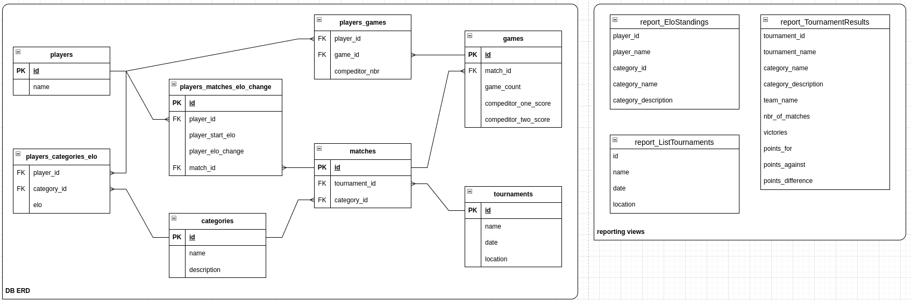

# Badminton Skill Calculator

This is for learing purpose for my own software development skills.
Not specifical meant for Badminton but I will use it to handle various badminton tournaments and competitions I take part in.

I'm using some basic ELO calculations setup to learn more about how ELO raking works and how best to implement it for my situation.

I might also write this project, with potentially limited scope, in other languages for learing purpose.

## ELO Ranking Logic

This is just prototype calculation logic. Various elements can change in the future.

#### Basic functionality

- Each player has their own ELO score.
- Each new player starts at ELO score of 1000.
- ELO is calculated for one player against each opponents ELO and total change is summed together. *This logic needs more testing on IRL data to validate if it's good idea or not.*
- ELO change is scaled based on the difference of players current ELO.
- ELO calculations is done for each match.
- Placement in Tournament does not provide any additional points.

#### Formulas and calculation logic

- `k_factor` is main "constant" that is used to scale the final ELO change 
- `current_ELO` is the current players ELO value before new ELO calculation is done
- `expectation` variable calculation: `expectation = 1/(1+10**((current_ELO - current_ELO) / 400))`
- `result` variable is 1 or 0 based if player won or loss
- Final ELO change calue calculation: `ELO_change_value = k_factor * (result - expectation)`

#### `k_factor` scaling

- Standard base value: `32`
- `k_factor` scaling up means that ELO change is higher, used if significantly lower ranked player wins against high ranked player. Meaning lower ranked player will gain more points and higher ranked player will also lose more points.
- Scaling down makes ELO change lower, used when significantly higher ranked player wins against lower ranked player so the ELO change should not be significant.

#### scaling up

- ELO difference > 200: `k_factor` = 70
- ELO difference between 200 and 100: `k_factor` = 52
- ELO difference between 100 and 20: `k_factor` = 40
- ELO difference between 20 and 0: `k_factor` = 32

#### scaling down

- ELO difference > 200: `k_factor` = 2
- ELO difference between 200 and 100: `k_factor` = 12
- ELO difference between 100 and 20: `k_factor` = 24
- ELO difference between 20 and 0: `k_factor` = 32

## Completed functionality

- reads in excel file in specific tournament format that it's developed for.
- creates team objects and does not create duplicates if the team members order changes from tournament to tournament.
- does ELO calculation game by game basis from first game of first tournament to last game of last tournament in scanned scope for each individiual player
- saves all data to SQLite database
- has few status reports for output from database

## Future Development

None of the points are in any specific priority order. I will work on any given topic that I'm interested in or if there is dependecy on it. 

List is not just code improvements but also project functionalities

### Near Future

- Various minor improvements in codes marked with TODO.
- Extract details from Tournament name and store them in DB.
- Store data of scanned tournaments in DB and keep track of ELO over time without having to reimport and calculate all data over again.
- Mixed naming usage of user/player needs to be all migrated to use player.
- Fix variable naming clarity in Game Handler for games and matches to represent the correct data being worked with.
- Add ELO confidence value and use it to handle ELO gain/loss.
- Handle players ranks through different competiontion categories.
- Tournament results statistics report users games count, this has to change when matches consist of multiple games
- Rework how commands are built and handled.

### Far Future

- Import game results(data) from Tournamentsoftare.com competition results, some webscraping probably needed.
- Generate some kind of HTML for static website content in case it's interesting for other compeditors.
- Build self service capability for someone else to work with their own tournaments, upload excel files or data and get status reports.

### Out of this application scope

- Build self service capability for someone else to work with their own tournaments, upload excel files or data and get status reports. Plan is to build separate web application that executes this code as needed.

## How to Use

Python version that was used to develop the application: Python 3.10

Required libraries: pandas, openpyxl, sqlite3

working directory should include the source data files. I provide example data both in txt file and also in excel file in how it's in final format.

For test execution run command: `python3 main.py`

For help information run command: `python3 main.py -h`

## ERD of the Tournament and players ELO

NOTE: the namings currently don't match and there is development taks to align all user/player naming convention

## Change Log

### Prototype v3

This is the final Prototype version. What and how this application works is more or less figured out so after this it will be moved to Alpha status.

- SQLite as data storage
- DB inclusion required rework on how teams, players, games and elo calculations are handled. Ultimately all players are with their own ELO score, no team based ELO.
- Cleanup of older version of functions that are no longer used and needed.

### Prototype v2

Secondary PoC, features remain the same as in prototype v1. Changes are mostly about project and code restrucuring.

- functions and classes are moved into packages
- improved verbosity in various functions and classes
- basic launch arguments handling logic
- separated test run using example txt file data and actual code execution that would use real data

### Prototype v1

Initial version as PoC

- able to extract games from exampel txt file and from actual use case excel documents
- handels teams objects creation
- goes through each game and calculates each teams ELO change
- final result is printed out
